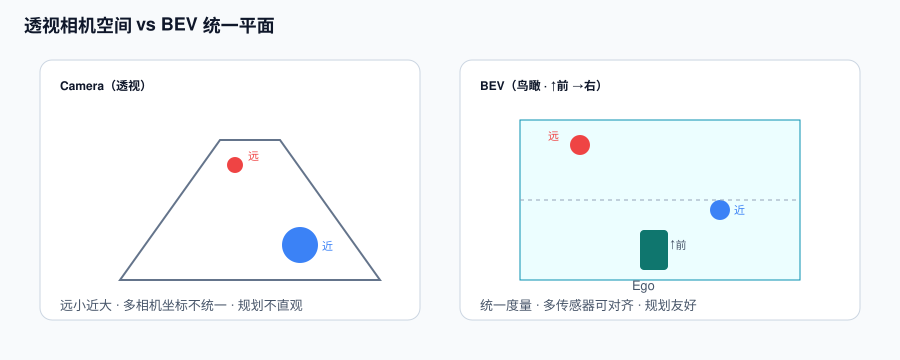
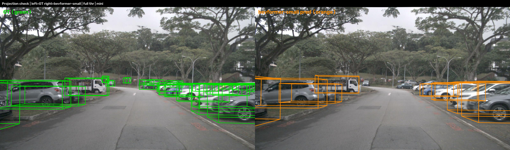
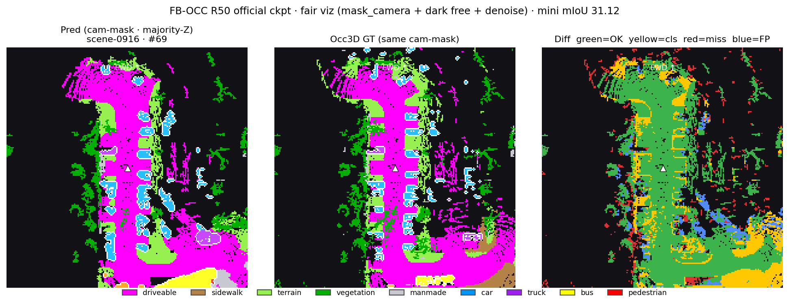

# 新一代自动驾驶感知栈工程复现

用 **nuScenes mini / Occ3D mini** 与各模型**官方预训练权重**，把 Camera/LiDAR 3D 检测、BEV、Occupancy、在线地图、Tracking、开放环规划，以及 VLM / 轻量 VLA **demo**，串成一条可跑通、可审查的工程链路。

重点不在刷 full-val 榜，而在：**坐标系与 box 约定**、`sample_token` 对齐、单卡老 OpenMMLab 环境、在线 3D MOT 与延迟拆解，以及每项结果**能证明什么、不能证明什么**（见 `evidence/`）。

> **项目定位**：有真实推理产物的工程学习与作品集。不是 full-val benchmark，也不代表从头训练、闭环验证或量产部署经验。

## 项目覆盖范围

```text
Camera ──→ BEVFormer / StreamPETR ─┐
                                    ├─→ 3D Detection ─→ Online 3D MOT
LiDAR ───→ CenterPoint ─────────────┘
Camera + LiDAR ─→ BEVFusion

Camera ─→ FB-OCC ───────────────→ 3D Occupancy / Free-space
Camera ─→ MapTR ────────────────→ Vectorized Online Map
Camera ─→ VAD / UniAD reference → Motion / Planning
Camera + Language ─→ DriveLM ───→ Graph VQA
Scene tokens + Language ─→ VLA ─→ Future Trajectory
```



## 结果一览


| 模块                    | 任务                            | 数据与口径                       | 本仓库结果                         | 证据  | 可视化                                                                                                             |
| --------------------- | ----------------------------- | --------------------------- | ----------------------------- | --- | --------------------------------------------------------------------------------------------------------------- |
| **BEVFormer-small**   | Camera dense-BEV 3D Det       | nuScenes mini val           | mAP **0.354** / NDS **0.399** | B   | [六相机](assets/det/bevformer_cams.png) · [GT vs Pred](assets/det/bevformer_gt_vs_pred.png)                        |
| **StreamPETR-R50**    | Camera sparse-query 3D Det    | nuScenes mini val           | mAP 0.437 / NDS 0.483         | B   | [六相机](assets/det/streampetr_cams.png) · [GT vs Pred](assets/det/streampetr_gt_vs_pred.png)                      |
| **CenterPoint**       | LiDAR 3D Det                  | nuScenes mini val；voxel 0.1 | mAP 0.520 / NDS 0.549         | B   | [BEV](assets/det/centerpoint_bev.png) · [GT vs Pred](assets/det/centerpoint_gt_vs_pred.png)                     |
| **BEVFusion**         | Camera+LiDAR 3D Det           | nuScenes mini val           | mAP **0.573** / NDS **0.580** | B   | [六相机](assets/det/bevfusion_cams.png) · [GT vs Pred](assets/det/bevfusion_gt_vs_pred.png)                        |
| **FB-OCC R50**        | Camera semantic occupancy     | Occ3D mini；81 samples       | mIoU **31.12**                | B   | [Pred vs GT](assets/fbocc/sample_1_pred_vs_gt.png) · [Z-slices](assets/fbocc/sample_1_zslices.png)              |
| **VAD-tiny**          | Detection / Motion / Planning | mini-filtered；open-loop     | Plan L2 0.405 / 0.637 / 0.913 | B   | [规划轨迹](assets/vad/vad_showcase.png)                                                                             |
| **MapTR-tiny**        | Online vectorized map         | nuScenes mini；Chamfer       | mAP 0.713                     | B   | [地图矢量](assets/maptr/maptr_showcase.png)                                                                         |
| **Online 3D MOT**     | CP（±SP）→ KF+NN                | mini 场景；非 challenge 评测      | 在线 ID/状态链路                    | B   | [L-only](assets/tracking/tracking_online_lidar.mp4) · [L+C](assets/tracking/tracking_online_lidar_cam.mp4)      |
| **E2E live MOT**      | CP+SP 真推理→track               | 10 scenes；成功计时 402 帧        | 910.72 ms / 约 1.1 FPS         | B   | [视频](assets/tracking/tracking_e2e_live_long_all.mp4) · [延迟 JSON](assets/tracking/latency_summary_long_all.json) |
| **DriveLM**           | Graph VQA                     | 官方 BIAS-7B + LLaMA-1        | 10/10 非空生成，非 accuracy         | C   | [QA card](assets/drivelm/drivelm_qa_card.png)                                                                   |
| **OpenDriveVLA-0.5B** | 轨迹生成                          | 自建 mini cache；4 条样例         | Demo，非 benchmark              | C   | [轨迹 showcase](assets/opendrivevla/opendrivevla_mini_showcase.png)                                               |


证据等级：**B** 表示已有指标摘要、结果图，以及 `evidence/<model>/`（manifest / 脱敏 log / commit·SHA256 等），但完整 `results.pkl` 不进 Git；**C** 表示少量 demo，只证明推理链路。详见 [结果与证据清单](docs/09-results-and-evidence.md) 与 [evidence/README.md](evidence/README.md)。

### 代表性结果



## 从哪里开始


### 只想快速理解技术栈

1. [技术栈总览](docs/05-stack-overview.md)
2. [BEV 与 3D 检测](docs/01-bev-3d-detection.md)
3. [Occupancy](docs/03-occupancy.md)
4. [端到端、地图与跟踪](docs/04-e2e-map-tracking.md)
5. [DriveLM](docs/05a-drivelm.md) 与 [VLA](docs/05b-vla.md)


### 想复现结果

1. 先看 [环境与数据集](SETUP.md)，按模型拆分 conda 环境。
2. 再按 [复现指南](REPRO.md) 执行具体命令。
3. 对照 [evidence/](evidence/README.md) 中已提交的 manifest；重新跑评测后用 `scripts/pack_evidence.sh` 刷新。
4. 遇到投影、朝向或 box z 问题，先查 [FAQ](docs/faq.md)。


### 关注训练或量产落地

- [数据采集、建库与训练](docs/06-data-and-training.md)
- [量产部署与加速](docs/07-deployment-acceleration.md)
- [算法选型与环境矩阵](docs/08-selection-and-env-matrix.md)

完整阅读导航见 [docs/README.md](docs/README.md)。

## 复现环境概要

- 单卡 **RTX 4090 24GB**，各模型 `batch_size=1`。
- Linux + CUDA 11.8；各仓库使用独立 conda 环境。
- 主数据为 nuScenes mini；Occupancy 另需 Occ3D mini GT。
- 上游仓库、数据与权重不包含在本仓库中。
- 老 OpenMMLab 项目可能需要单卡 test patch、CUDA op 编译或 flash-attention 回退；所有 patch 都应保存为 diff。

本仓库不是“一套环境运行全部模型”。详细 torch/mmcv/mmdet3d 组合见 [环境矩阵](docs/08-selection-and-env-matrix.md)。

## 关键工程结论

1. **图像对齐必须使用** `sample_token`，不能假定不同模型输出 list 的下标一致。
2. **BEV 绘制先统一到 ego 坐标**；nuScenes `LIDAR_TOP` 相对 ego 的旋转会让错误绘图看起来转了约 90°。
3. **box z 语义因模型而异**：有的输出 bottom center，有的已经是 gravity center，不能统一盲加 `h/2`。
4. **可视化不能反向污染评测**：阈值、去噪和 Z 向投票只用于展示，mAP/NDS/mIoU 必须来自原始 evaluator。
5. **时序 query 不等于完整 MOT**：规划所需的稳定 ID 与运动状态仍需显式或内生化 tracking。
6. **生成非空不等于正确**：DriveLM/VLA 还需要事实核验、3D grounding、闭环验证和安全约束。
7. **4090 延迟不是车载性能**：当前双检测器串行 PyTorch 链路约 1.1 FPS，只能作为瓶颈分析依据。


## 文档索引


| 文档                                                  | 主要内容                                           |
| --------------------------------------------------- | ---------------------------------------------- |
| [SETUP](SETUP.md)                                   | 数据、权重、目录与环境准备                                  |
| [REPRO](REPRO.md)                                   | 每个模块的实际推理/评测命令和完成定义                            |
| [01 · BEV 与 3D 检测](docs/01-bev-3d-detection.md)     | LSS、BEVFormer、StreamPETR、CenterPoint、BEVFusion |
| [02 · BEVFormer 数据流](docs/02-bevformer-pipeline.md) | TSA、SCA、reference point、tensor shape           |
| [03 · Occupancy](docs/03-occupancy.md)              | Box vs OCC、FB-OCC、可见性与安全不对称                    |
| [04 · 端到端、地图与跟踪](docs/04-e2e-map-tracking.md)       | VAD、UniAD、MapTR、在线双模态 MOT                      |
| [05 · 技术栈总览](docs/05-stack-overview.md)             | 从传统 L2 到 BEV/OCC/E2E/VLM/VLA                   |
| [05a · DriveLM](docs/05a-drivelm.md)                | Graph VQA、adapter 推理与边界                        |
| [05b · VLA](docs/05b-vla.md)                        | OpenDriveVLA、action grounding 与样例限制            |
| [06 · 数据与训练](docs/06-data-and-training.md)          | 数据采集、infos/Occ3D 建库、训练要点                       |
| [07 · 部署与加速](docs/07-deployment-acceleration.md)    | 瓶颈、TRT/量化/并行/降频和安全降级                           |
| [08 · 选型与环境矩阵](docs/08-selection-and-env-matrix.md) | 模型、数据、云机和 conda 版本选择                           |
| [09 · 结果与证据](docs/09-results-and-evidence.md)       | 证据等级、公开状态与待补原始材料                               |
| [FAQ](docs/faq.md)                                  | token、ego/lidar、yaw、z 和展示约定                    |
| [THIRD_PARTY](THIRD_PARTY.md)                       | 上游项目、权重、数据和许可证边界                               |


## 目录结构

```text
adas-perception-stack-repro/   # GitHub: aiwenlan/adas-perception-stack-repro
├── README.md
├── SETUP.md
├── REPRO.md
├── LICENSE · THIRD_PARTY.md
├── docs/                 # 原理、训练、部署、FAQ、证据清单
├── assets/
│   ├── det/              # 六相机、BEV、GT-vs-Pred、z 消融
│   ├── fbocc/            # OCC pred/GT、occupied-only、z-slices
│   ├── tracking/         # GT ID、在线 MOT、E2E live 与 latency
│   ├── vad/ · maptr/ · drivelm/ · opendrivevla/
│   └── *.svg
├── evidence/             # 各模型小型证据包（见 evidence/INDEX.md）
└── scripts/
    ├── online_*_mot.py / run_*.sh   # 在线 MOT
    └── pack_evidence.sh             # 从训练机打包/刷新 evidence
```


## 结果解释边界

- 所有检测、地图、规划与 OCC 数字都来自 **mini 子集**，不能与论文 full-val 表格直接比较。
- 检测/OCC/VAD/MapTR 使用官方预训练权重；本仓库没有从头训练这些模型。
- DriveLM 本轮使用官方 BIAS-7B，不是个人历史 finetune checkpoint。
- OpenDriveVLA 只有少量样例，自建 mini cache 的历史轨迹可能不完整。
- Online MOT 是 KF + nearest-neighbor 工程链路，不是 nuScenes Tracking Challenge 刷榜提交。
- E2E live MOT 是同进程双模型 GPU 推理，不等于一个联合训练的端到端网络。
- Open-loop planning 指标和 4090 PyTorch 延迟都不能替代闭环安全与车端性能验证。
- 投影图使用固定阈值和近平面裁剪，不进行 GT 匹配过滤美化。


## License 与第三方组件

- 本仓库**原创**文档与脚本：见根目录 [LICENSE](LICENSE)（MIT）。
- 上游代码、权重和数据：各自许可证与访问条件，见 [THIRD_PARTY.md](THIRD_PARTY.md)。MIT 不覆盖、也不替代第三方组件的许可。

