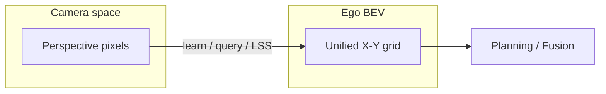
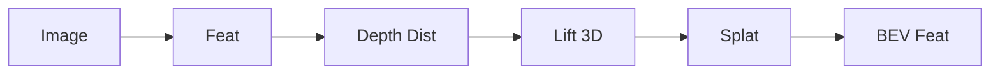
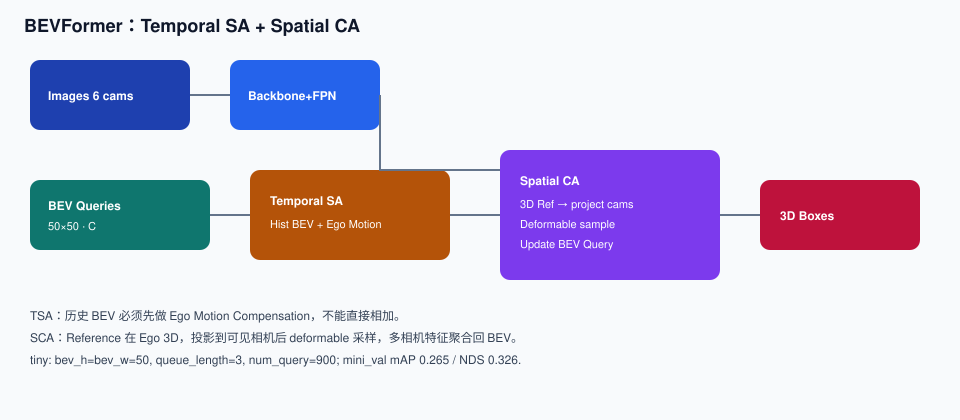
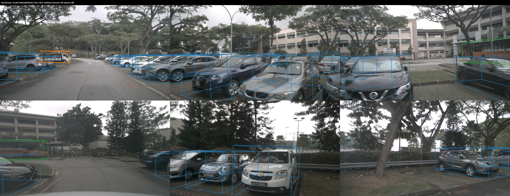
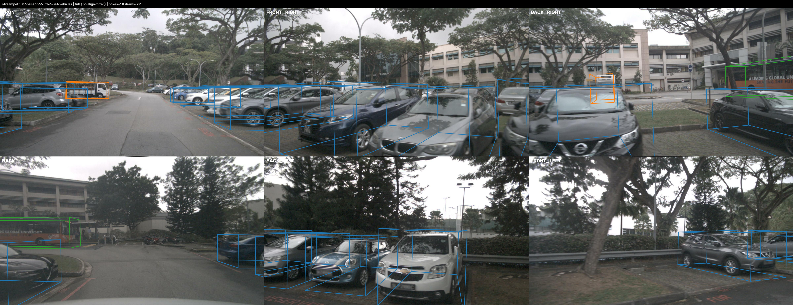
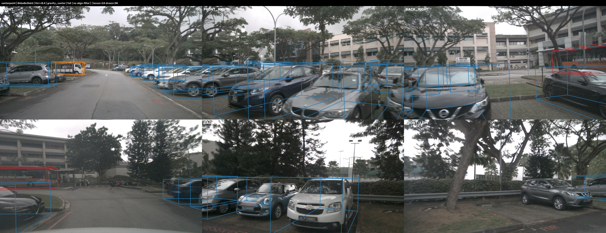
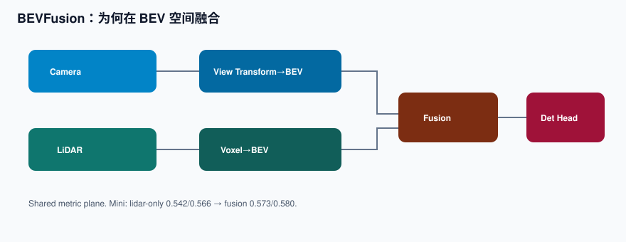
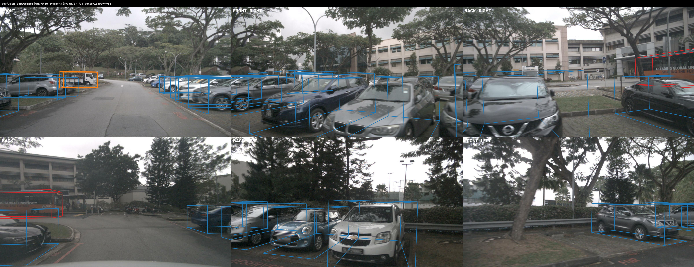
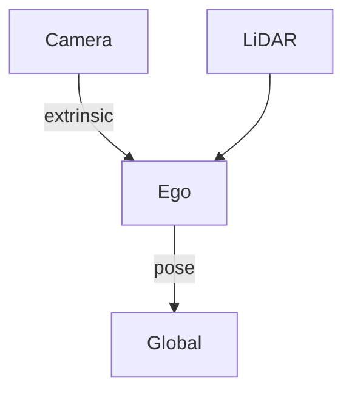

# 01 · BEV 与 3D 检测

## 为什么需要 BEV

相机成像是透视投影：远小近大、尺度随深度变化，多相机各有一套像素坐标。规划与多传感器融合需要 **统一的车体（Ego）水平面表征**，使同一条车道、同一障碍在各视角对齐。

| | 2D Det | BEV / 3D |
|---|---|---|
| 坐标 | 像素 | Ego / 全局 |
| 多相机 | 难对齐 | 天然统一 |
| 规划 | 需再投影 | 距离 / 车道可直接用 |

**IPM vs 现代 BEV**：IPM 依赖地平面假设，坡道与高障碍会歪。现代网络学习深度，或用 Query 采样图像特征，**不等于 IPM**。

## 三条相机 BEV / 检测路线

### 显式 Depth（LSS / BEVDet）

像素按深度分布「抬」到 3D，再压到 BEV。深度误差会直接污染 BEV 特征。

### Dense Query BEV — BEVFormer

本机曾跑 tiny：mini_val **mAP 0.2649 / NDS 0.3255**（轻量对照）。  
主展示：**BEVFormer-small**，mini_val **mAP 0.3541 / NDS 0.3989**。

六相机投影（`sample_token` 对齐 · thr≥0.40 · 近平面裁剪 · **无 GT-align 过滤**）：

### Sparse Query — StreamPETR

不建稠密 BEV grid。复现（R50）：**mAP 0.4370 / NDS 0.4831**。

| | BEVFormer | StreamPETR |
|---|---|---|
| 表征 | Dense BEV | Sparse 3D Query |
| 优势 | 利于 map / occ / 多任务共享 | 算力更盯目标 |

## 点云 — CenterPoint

Center-based：中心热力图 + 属性回归。复现（voxel 0.1）：**mAP 0.5196 / NDS 0.5494**。

## 多模态检测 — BEVFusion

在 BEV 融合可保持统一度量平面，并支持单模态降级。mini val：lidar-only **0.542 / 0.566** → cam+lidar **0.573 / 0.580**。

> **本仓库跟踪主路径不用 BEVFusion。** 在线 MOT 接入 **CenterPoint（LiDAR）+ StreamPETR（相机 3D）**，融合发生在跟踪器异步更新里（见 [04](04-e2e-map-tracking.md)）。此处保留 BEVFusion，是为了区分「检测层 BEV 融合」与「跟踪层多传感器更新」。

## 坐标系

时序特征聚合前必须做 **Ego Motion Compensation**。

## 指标汇总

| 模型 | mAP | NDS | 投影图 |
|---|---:|---:|---|
| BEVFormer-tiny（对照） | 0.265 | 0.326 | 未单独发布 tiny 投影图 |
| **BEVFormer-small** | **0.354** | **0.399** | [cams](../assets/det/bevformer_cams.png) |
| StreamPETR-R50 | 0.437 | 0.483 | [cams](../assets/det/streampetr_cams.png) |
| CenterPoint | 0.520 | 0.549 | [cams](../assets/det/centerpoint_cams.png) |
| BEVFusion fusion | **0.573** | **0.580** | [cams](../assets/det/bevfusion_cams.png) |

GT 参考：[`gt_cams.png`](../assets/det/gt_cams.png)。BEV 俯视图：`assets/det/*_bev.png`。

GT vs Pred（绿 GT / 橙 Pred，已按正确 z 约定）：  
[BEVFormer](../assets/det/bevformer_gt_vs_pred.png) · [StreamPETR](../assets/det/streampetr_gt_vs_pred.png) · [CenterPoint](../assets/det/centerpoint_gt_vs_pred.png) · [BEVFusion](../assets/det/bevfusion_gt_vs_pred.png)

投影 / z / yaw 细节见 [FAQ](faq.md)。
