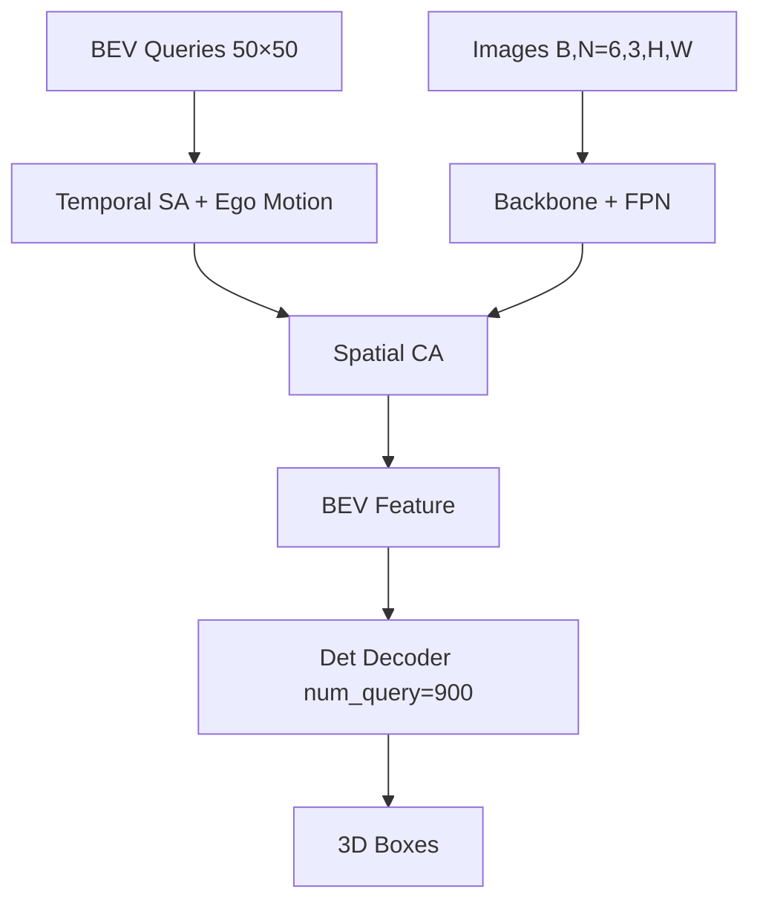
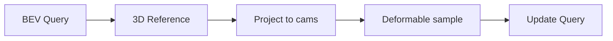

# 02 · BEVFormer 数据流

主链路：Image → Backbone/FPN → BEV Encoder（TSA + SCA）→ Det Head → 3D Box。  
复现（**small**，mini val，81 帧）：mAP **0.3541** / NDS **0.3989**（tiny 对照为 0.2649 / 0.3255）。


## 总体结构

（结构同 tiny；small 为更大 backbone / BEV 分辨率，主链路仍是 TSA + SCA。）




## Tensor Shape（tiny 配置）


| 阶段        | Shape                | 说明                          |
| --------- | -------------------- | --------------------------- |
| 输入        | `[B, 6, 3, H, W]`    | 6 相机                        |
| FPN       | `[B, 6, C', H', W']` | 多尺度图像特征                     |
| BEV Query | `[B, 2500, C]`       | `bev_h = bev_w = 50`        |
| 时序        | `queue_length = 3`   | 当前 + 历史                     |
| Decoder   | `num_query = 900`    | 检测 query                    |
| 输出        | 3D boxes             | cls / xyz / whl / yaw / vel |


> Shape 约定：上游实现为了 attention 效率会在 `[B, N, C]`、`[N, B, C]` 和多尺度 flatten 表示之间变换。调试时不能只看维度数字，必须同时记录每一维的语义。small 与 tiny 的 BEV 分辨率、backbone 和显存不同；本表只用于解释主链，不把 tiny shape 当成 small 的精确配置。


## 代码调用链

不同 commit 的文件组织会略有差异，但官方工程的关键职责基本如下：


| 阶段                     | 典型类 / 方法                                 | 需要观察的内容                                                   |
| ---------------------- | ---------------------------------------- | --------------------------------------------------------- |
| Detector               | `BEVFormer.forward_train/forward_test`   | 时序队列如何拆帧；`prev_bev` 何时置空                                  |
| Image feature          | `extract_img_feat` / `extract_feat`      | `[B,N_cam,3,H,W]` 如何合并 batch 和 camera 再恢复                 |
| Detection head         | `BEVFormerHead.forward`                  | BEV query、object query、reference points 如何进入 transformer  |
| BEV encoder entry      | `PerceptionTransformer.get_bev_features` | `can_bus`、shift、rotation、spatial shapes、level start index |
| Encoder                | `BEVFormerEncoder.forward`               | reference points、camera projection、可见性 mask               |
| Encoder layer          | `BEVFormerLayer.forward`                 | TSA → normalization → SCA → FFN 的执行顺序                     |
| Temporal attention     | `TemporalSelfAttention.forward`          | 当前 query 与 `prev_bev` 的拼接、采样偏移和权重                         |
| Spatial attention      | `SpatialCrossAttention.forward`          | query 如何按可见相机 rebatch，再聚合回 BEV                            |
| 3D deformable sampling | `MSDeformableAttention3D`                | 多尺度 feature、sampling locations、attention weights          |
| Decode                 | bbox coder / `get_bboxes`                | 归一化坐标恢复到 `pc_range`，box z/yaw/velocity 语义                 |


推荐为每个节点记录四件事：`shape`、坐标系、有效 mask、输入来自当前帧还是历史帧。只列类名而不写这四项，仍然无法定位投影或时序错误。

## Temporal Self-Attention


| 问题          | 要点                      |
| ----------- | ----------------------- |
| 为何要历史 BEV？  | 遮挡、闪烁、速度更稳              |
| 为何不能直接相加？   | 车在动，格子对不齐               |
| Ego Motion？ | 历史 Ego → 当前 Ego 刚体 warp |


还要区分三个概念：

1. **静态世界对齐**：由前后帧 ego pose 的平移和旋转决定。
2. **动态目标运动**：不能仅靠 ego compensation 消除，需要网络或后续 motion/track 表达。
3. **首帧与 scene reset**：没有合法历史时必须清空 `prev_bev`，否则会把上一场景特征带入下一场景。

常见失败表现：整张 BEV 出现固定方向拖影，优先查 ego yaw/单位；只在 scene 边界异常，优先查历史状态 reset；动态车拖影而道路正常，说明静态对齐可能正确，但动态建模不足。

## Spatial Cross-Attention




Reference 在 **Ego 3D**，不是像素；多相机可见则聚合。

投影链可写成：

```text
normalized BEV reference
  → 由 pc_range 恢复 ego 3D
  → ego/lidar 到 camera 的外参
  → camera intrinsic
  → 透视除法得到像素
  → 归一化到 feature-map sampling coordinates
  → image-bound / positive-depth mask
```

任何一步把矩阵方向、齐次坐标或图像增强矩阵用反，都会造成“代码能跑但采样位置错误”。因此可见性 mask 的比例、投影点散点图和单相机 sanity check 比只看最终 mAP 更适合早期排错。

## 从网络输出到 nuScenes 3D Box

1. Decoder 为每个 object query 输出分类分数和归一化 box 参数。
2. bbox coder 根据 `pc_range` 解码中心、尺寸、yaw 和 velocity。
3. evaluator 需要明确输出位于 ego、lidar 还是 global；提交 nuScenes JSON 时通常还要结合 ego pose 转换。
4. 可视化必须按 `sample_token` 取对应标定，不能用数组下标假定帧对齐。
5. z 不能统一盲加 `h/2`；本项目的逐模型约定见 [FAQ](faq.md)。


## 最小调试清单

- [ ] 首帧禁用历史后结果仍合理。
- [ ] 同一静态点从上一帧变换到当前 ego 后位置一致。
- [ ] reference point 投到相机后，正深度且位于图像范围的比例合理。
- [ ] 六相机之间没有左右/前后互换。
- [ ] 图像 resize/crop/flip 后同步更新投影矩阵。
- [ ] 输出 box 的 x/y/z、l/w/h、yaw 定义与 evaluator 一致。
- [ ] 结果与图像按 `sample_token` 对齐。
- [ ] small 与 tiny 分别记录 config、checkpoint 和日志，不能共用一条结果记录。


## 快速对比


|               | BEVFormer                               | StreamPETR      | CenterPoint | BEVFusion       |
| ------------- | --------------------------------------- | --------------- | ----------- | --------------- |
| 表征            | Dense BEV                               | Sparse 3D Query | Voxel→BEV   | Cam+LiDAR BEV   |
| mini（mAP/NDS） | **small 0.35 / 0.40**（tiny 0.26 / 0.33） | 0.44 / 0.48     | 0.52 / 0.55 | **0.57 / 0.58** |


推理命令见 [REPRO.md](../REPRO.md)；环境见 [SETUP.md](../SETUP.md)。