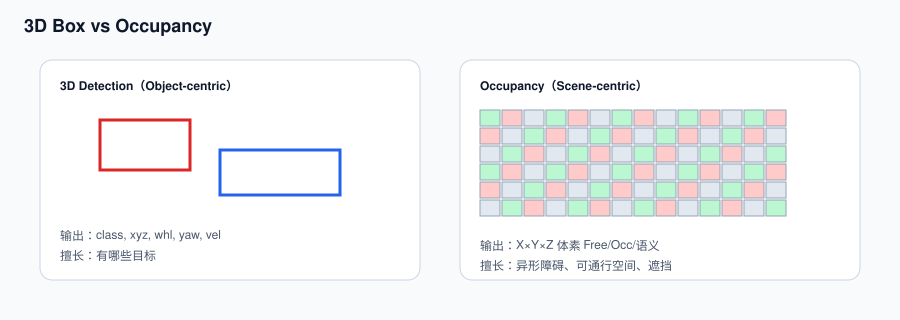
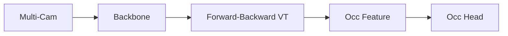
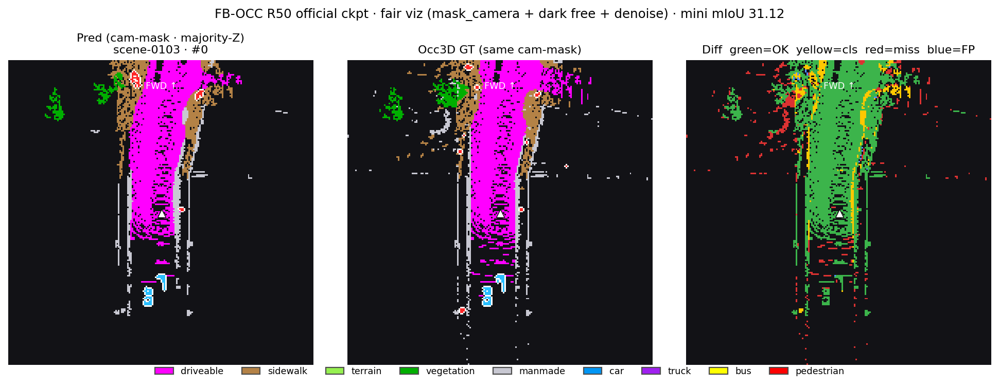
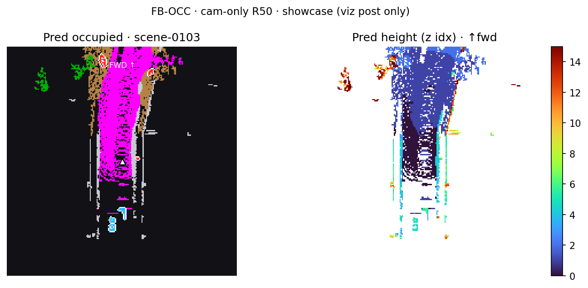
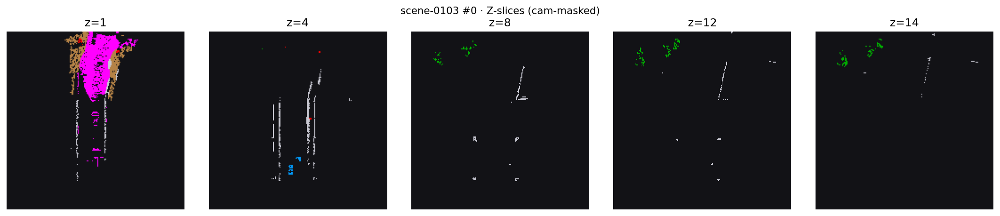

# 03 · Occupancy 感知



## 已有 3D Detection，为何还要 Occupancy

- 3D Det 输出 object box（class / xyz / whl / yaw / vel），擅长「有哪些目标」。
- Occupancy 输出 X×Y×Z 体素语义 / 占据，擅长「空间每块是什么」：Free / Occupied / Unknown + 语义类。
- 异形障碍、施工区、护栏、植被、大型车辆非规则区域、遮挡后的 free-space —— box 表达力不够。

## 演进


| 阶段 | 解决什么 | 新增能力 | 对 Planning |
|---|---|---|---|
| 3D Det | 目标定位 | box + 速度 | 目标交互 |
| BEV | 多相机统一 | 俯视稠密特征 | 车道 / 地图友好 |
| OCC | 场景空间 | 体素占据 / 语义 | free-space / 碰撞更自然 |

## FB-OCC



- RTX 4090 · mini val 推理约 6.5 it/s · 官方 R50 config  
- **mIoU（Occ3D mini，81 samples）：31.12**  
  - driveable 74.1 · manmade 49.6 · car 41.4 · sidewalk 41.4 · vegetation 39.6  

### 输入、输出与监督

| 项 | 含义 |
|---|---|
| 输入 | 多相机当前/历史图像、标定、ego pose；具体帧数由 config 决定 |
| 中间表征 | 图像 feature → view transformation → 3D/BEV-aligned occupancy feature |
| 输出 | `[X,Y,Z,C]` 或等价布局下每个 voxel 的语义 logits |
| GT | `semantics` 以及 `mask_camera` / `mask_lidar` 等可见性 mask |
| 评测 | 在明确 mask 和类别集合后计算 per-class IoU / mIoU |

体素大小决定精度、显存和延迟：空间范围不变时，边长减半会让三维 voxel 数量近似增加到 8 倍。量产设计通常会使用非均匀范围、稀疏表示、分层分辨率或只在规划走廊保留高精度。

### Free、Occupied、Unknown 不应混为一类

- **Occupied**：观测或标注表明空间被实体/表面占据。
- **Free**：传感器射线可见且在命中表面之前的空间；不是“没有标签就算 free”。
- **Unknown / unobserved**：遮挡、视野外、距离过远或没有足够观测，通常应 ignore 或单独处理。

如果训练或评测时把 unknown 当 free，离线数字可能看起来更好，但规划会把没有证据的区域误当成可通行空间。

### Pred vs Occ3D GT（公平可视化）

两侧都加 **`mask_camera`**、free 暗底、Z 向多数表决 + 轻量去噪（仅展示，不改 mIoU）。第三列 Diff：绿=对，黄=类错，红=漏检，蓝=虚检。


另一帧（scene-0103）：



Occupied-only + 高度：



Z-slices：



**读图边界**

- 旧图 GT「更细」是因为把相机看不见的 LiDAR 体素也画出来了；公平对比后两侧密度接近。  
- Pred 仍会比 GT 钝（cam-only R50）——能力量级，不是权重装错。  
- mIoU 31.12 = Occ3D **mini**；官方 R50 full-val ≈ 39.1。

可视化中的 Z 向多数表决、occupied-only 或轻量去噪只是把 3D tensor 压成容易阅读的 2D 图；它们不能替代逐 voxel evaluator，也不能反向修改提交评测的预测。

## 指标与安全不对称

- **Semantic IoU / mIoU**：观察每个语义类，容易被大类和类别集合影响。
- **Occupied/free precision、recall、IoU**：更直接反映漏障碍与虚警。
- **Ray-based 指标**：沿视线考察表面位置和可见性时更有意义，但必须与采用同一指标的工作比较。
- **Free→Occupied**：保守虚警，可能造成急刹、绕行和可用性下降。
- **Occupied→Free**：漏障碍，规划可能驶入碰撞空间，通常安全代价更高。

## 与规划接口

OCC 给规划的不是一张彩色图，而是时空约束：

```text
semantic occupancy / occupancy probability
  → inflation by ego footprint and uncertainty
  → collision cost / drivable corridor
  → trajectory optimization or candidate filtering
```

静态 OCC 只描述当前空间；处理动态交通参与者还需要实例、velocity/flow、tracking 或 occupancy forecasting。Box 与 OCC 因此是互补关系，而不是后者完全替代前者。

## 排错清单

- [ ] 核对 tensor 的 X/Y/Z 维度顺序和每个轴的物理方向。
- [ ] 核对 voxel origin、`pc_range`、voxel size 与 GT 完全一致。
- [ ] 确认 free label、ignore label 和语义类 ID 没有错位。
- [ ] 评测明确使用 `mask_camera`、`mask_lidar` 还是全空间。
- [ ] GT 与预测按 sample token 对齐，不按列表下标拼接。
- [ ] 可视化旋转/翻转不会改变评测 tensor。
- [ ] mIoU 同时报告样本数、类别集合和 per-class 结果。
