# 04 · 端到端、地图与跟踪

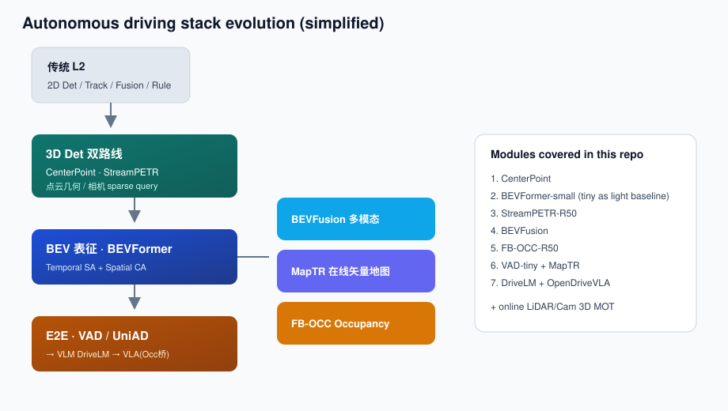

## 三种「端到端」（勿混谈）

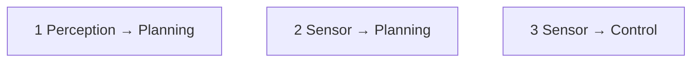


## VAD-Tiny

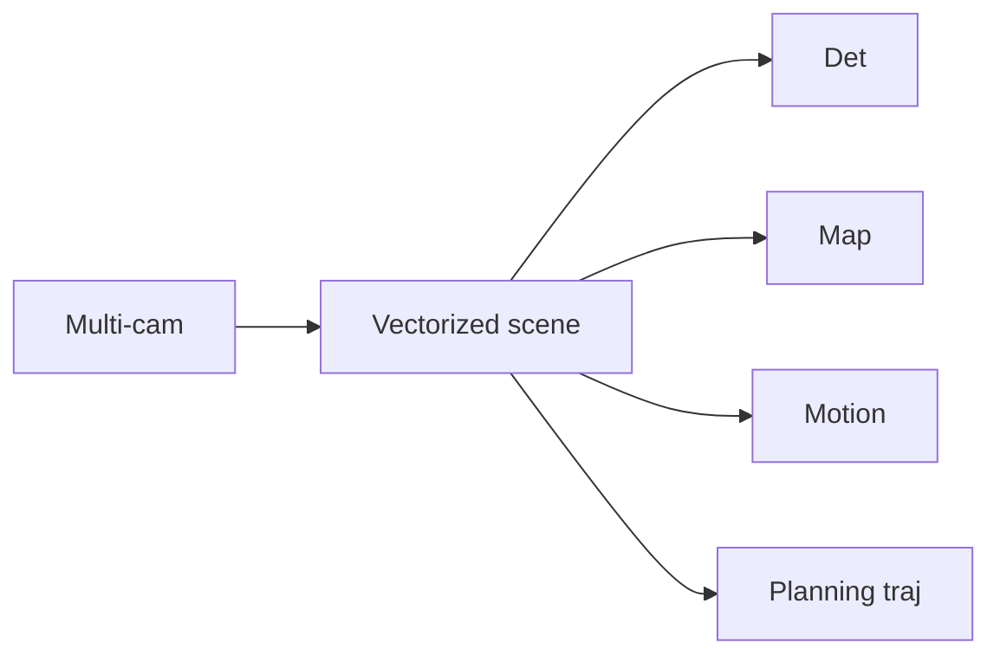


- mini-filtered 162：mAP **0.266** / NDS **0.359**  
- plan L2 @ 1/2/3s = **0.405 / 0.637 / 0.913**；碰撞率 0  
- 保留可解释中间表征，不是纯 black-box control

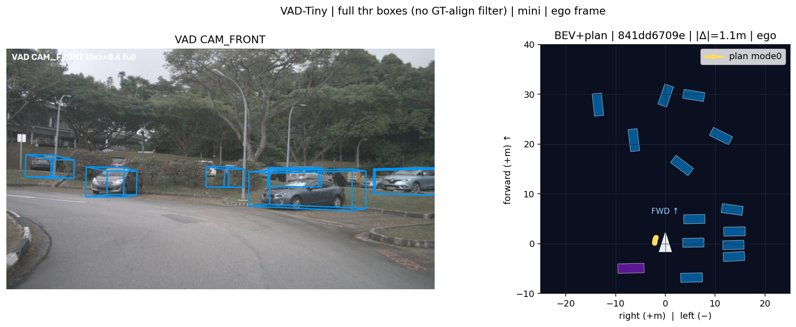

左：token 对齐后的 CAM_FRONT 投影（thr≈0.35 + 近平面裁剪）；右：BEV 目标框 + **plan mode0** 轨迹。

## UniAD（架构参考）

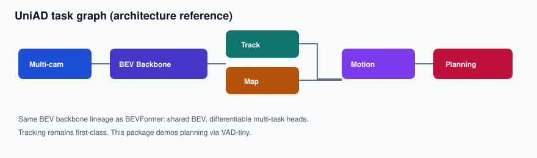

Track / Map / Motion / Planning 可微串联，与 BEVFormer 骨干同源。本仓库规划演示主跑 VAD；UniAD 用于系统对照。

## MapTR-tiny


- mini val Chamfer mAP **0.713**  
- `geometric_kernel_attn` 需 nvcc；单卡 test 路径需打开

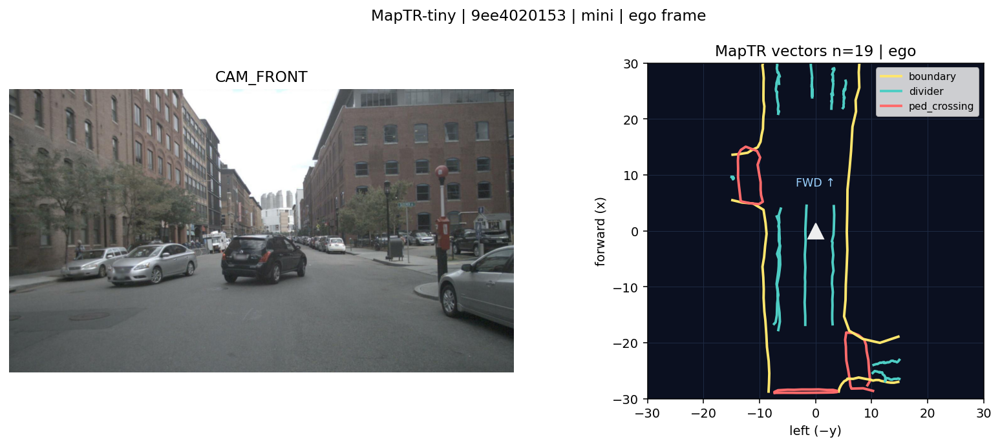

图例：`divider` / `ped_crossing` / `boundary`（thr≈0.35）。

## Detection 之后为何还要 Tracking

BEV / E2E 时代 Tracking **未消失**：要么显式 Track 头（如 UniAD TrackFormer），要么在 sparse query / 时序注意力里内生化关联。

### 概念底线：GT instance ID

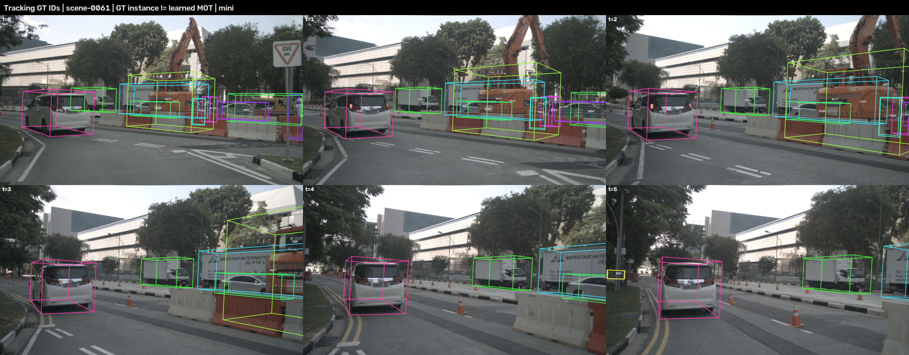

视频（同色同 ID）：`[tracking_gt_ids.mp4](../assets/tracking/tracking_gt_ids.mp4)`

### 工程路径：3D 感知 → 在线 KF + NN MOT

算法对齐公开仓库 [Lidar-based-Multi-Object-Tracking](https://github.com/allrivertosea/Lidar-based-Multi-Object-Tracking)（Kalman Filter + 最近邻门限）。

**在线**：每帧 CenterPoint 3D 框立刻 `Tracker.run`（不是先 dump 全 scene 再离线 MOT）。  
**传感器**：LiDAR + Camera；**不要**毫米波 / BEVFusion。视觉侧用 StreamPETR **3D** 框（不是 2D bbox）。

`scene-0103` 演示（检完一帧立刻跟）：


| 模式                        | 末帧                                                              | 视频                                                                                      |
| ------------------------- | --------------------------------------------------------------- | --------------------------------------------------------------------------------------- |
| L-only（CenterPoint）       | 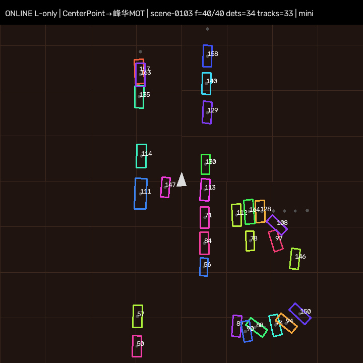         | `[tracking_online_lidar.mp4](../assets/tracking/tracking_online_lidar.mp4)`             |
| L+C（+ StreamPETR 3D，结果回放） | 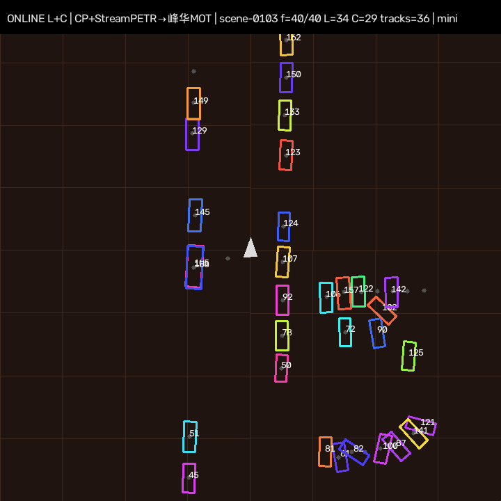    | `[tracking_online_lidar_cam.mp4](../assets/tracking/tracking_online_lidar_cam.mp4)`     |
| **E2E 真推理 L+C**           | 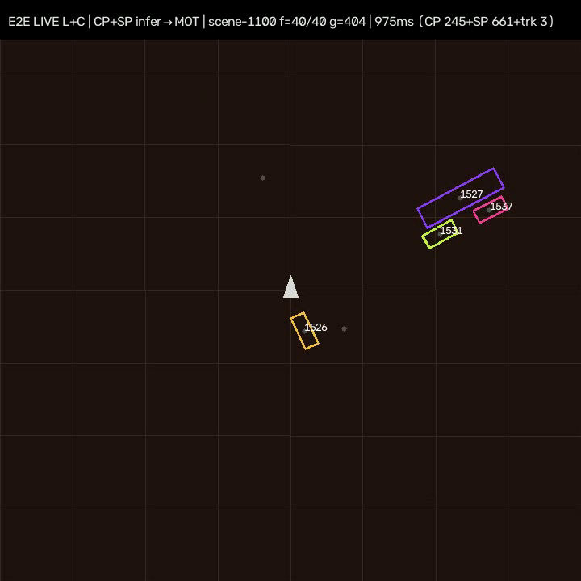 | `[tracking_e2e_live_lidar_cam.mp4](../assets/tracking/tracking_e2e_live_lidar_cam.mp4)` |


**加长版（仍用 mini，不下全量）**


| 模式          | 范围                                 | 视频                                                                                                    |
| ----------- | ---------------------------------- | ----------------------------------------------------------------------------------------------------- |
| L-only 回放   | mini-val · **81** 帧                | `[tracking_online_lidar_long_val.mp4](../assets/tracking/tracking_online_lidar_long_val.mp4)`         |
| L+C 回放      | mini-val · **81** 帧                | `[tracking_online_lidar_cam_long_val.mp4](../assets/tracking/tracking_online_lidar_cam_long_val.mp4)` |
| **E2E 真推理** | mini 全部 10 scene；成功处理并计时 **402** 帧 | `[tracking_e2e_live_long_all.mp4](../assets/tracking/tracking_e2e_live_long_all.mp4)`                 |


### 同进程真推理延迟（RTX 4090 / mini / **10 scenes · 402 帧计时**）

每帧：CenterPoint GPU 推理 → StreamPETR GPU 推理 → DualTracker（脚本 `scripts/online_e2e_dual_mot.py`）。


| 段           | mean       | p50        | p95         |
| ----------- | ---------- | ---------- | ----------- |
| CenterPoint | 209 ms     | 208 ms     | 249 ms      |
| StreamPETR  | 626 ms     | 624 ms     | 716 ms      |
| Track       | 7 ms       | 3 ms       | 21 ms       |
| **合计**      | **911 ms** | **909 ms** | **1020 ms** |


约 1.1 FPS（未 TRT）。明细见 `[latency_summary_long_all.json](../assets/tracking/latency_summary_long_all.json)`。mini 场景元数据帧数与脚本成功完成双模型推理、进入计时的帧数不是同一口径；本仓库延迟结论以 JSON 的 `n_frames=402` 为准。

设计要点：

1. Det 每帧独立框 → 无 ID 则预测 / 规划不知道「哪个车在变道」。
2. Track 目标：稳定 ID + 运动状态（位置 / 速度），供预测与交互。
3. 本栈 = 模块化感知（CenterPoint / StreamPETR）+ 显式 3D MOT；StreamPETR 时序 query ≠ 完整 MOT ID。
4. 融合在跟踪器异步更新里做，不靠再训一个 BEVFusion。

脚本：`[scripts/online_lidar_mot.py](../scripts/online_lidar_mot.py)`、`[scripts/online_dual_mot.py](../scripts/online_dual_mot.py)`。

## 模块化 L2 vs 可解释 E2E

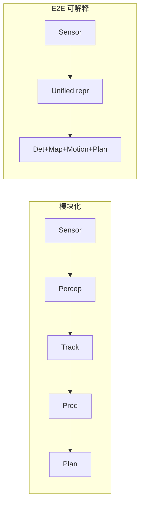


| 维度   | 模块化 L2                          | 可解释 E2E / 联合多任务                  |
| ---- | ------------------------------- | -------------------------------- |
| 接口   | box、track、lane、trajectory 等人工定义 | query / shared feature + 部分结构化输出 |
| 优点   | 易定位、易替换、规则和安全边界清楚               | 减少接口信息损失，任务目标可联合优化               |
| 风险   | error propagation、阈值和规则膨胀       | 错误耦合、梯度冲突、验证和回归更困难               |
| 适合验证 | 模块指标 + 系统回放                     | 模块指标 + 任务指标 + 闭环与故障注入            |


端到端不等于必须输出方向盘，也不等于删除所有中间监督。VAD/UniAD 这类方案保留 det/map/motion/plan 表征，工程上更容易做可视化、约束和问题归因。

## Open-loop 与 Closed-loop


|      | Open-loop                  | Closed-loop          |
| ---- | -------------------------- | -------------------- |
| 后续观测 | 来自固定日志，不受模型动作影响            | 模型动作改变车辆状态与后续场景      |
| 常见指标 | 轨迹 L2、离线 collision、ADE/FDE | 碰撞、接管、进度、规则、舒适性、恢复能力 |
| 优点   | 快、可重复、适合训练和回归              | 能暴露交互反馈和误差累积         |
| 局限   | 好看的 L2 不保证可驾驶              | 成本高，仿真真实性和场景覆盖仍有限    |


本仓库 VAD 指标属于 **open-loop mini**。`collision=0` 只说明该子集、该 evaluator 下没有记录到碰撞，不能推出高速、城市闭环或量产安全结论。

## 从传统 L2 渐进升级

不建议把 `Camera + Radar → Det/Track → TTC → Rule → Brake` 一次改成 sensor-to-control。更可控的路径是：

```text
Camera + Radar + optional LiDAR
        ↓ calibration / synchronization / health monitor
Unified BEV perception
        ├─ Object + Track
        ├─ Online Map
        └─ Occupancy / Free-space
        ↓
Prediction + interpretable learned planner
        ↓
Trajectory feasibility / collision checker
        ↓
Controller

Independent path: AEB/CMBS + ODD monitor + minimal-risk fallback
```

1. **影子模式**：新 BEV/OCC 只记录和对比，不控制车辆。
2. **辅助输入**：向旧 planner 提供更好的目标、地图和 free-space，保留原安全链。
3. **限定 ODD 接管**：学习型 planner 只在已验证 ODD 输出轨迹，独立 safety cage 做动力学、碰撞和规则检查。
4. **逐步扩 ODD**：依据接管原因、闭环场景和 regression gate 扩展，不以单一离线分数放行。

Radar 不应因“纯视觉叙事”被删除；OCC 也不应让 object/track 消失。恶劣天气径向速度、稳定 ID、交互预测和独立安全监控仍具有系统价值。

## 系统验收清单

- [ ] 传感器时钟、外参漂移和 ego pose 质量可监控。
- [ ] scene 边界正确清空历史 query/track 状态。
- [ ] Map/OCC/Object 的坐标范围和时间戳一致。
- [ ] planning 输出通过动力学、碰撞、交通规则和舒适性检查。
- [ ] p50/p95/p99 延迟和 deadline miss 可观测；超时有确定性降级。
- [ ] 单传感器失效、错误标定、脏污和丢帧有故障注入验证。
- [ ] 离线、仿真、封闭场、影子模式和道路测试分层放行。
- [ ] 独立 AEB/最小风险策略不会与学习型 planner 形成危险控制冲突。