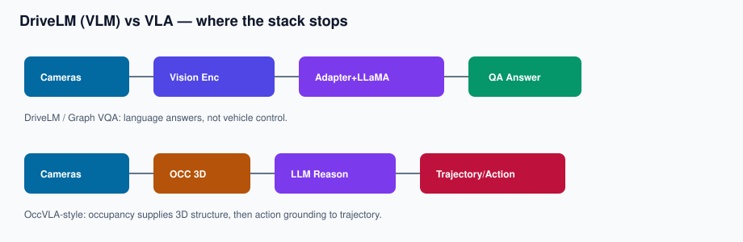
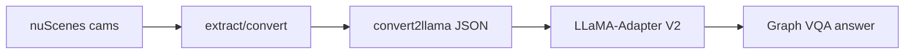
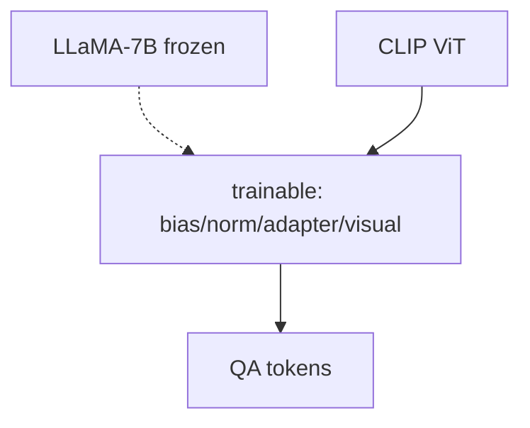
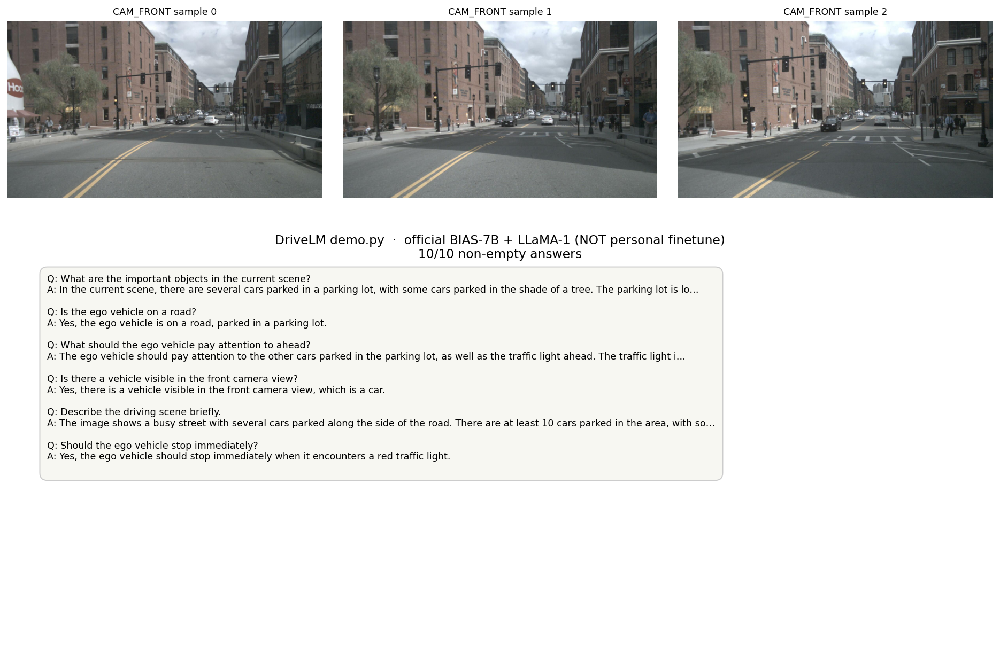

# 05a · DriveLM（VLM / Graph VQA）

## 定位

- 上游：[Finetune-e2e-model-DriveLM](https://github.com/aiwenlan/Finetune-e2e-model-DriveLM)
- 栈：LLaMA-Adapter V2 Multimodal **7B** + DriveLM Graph VQA
- 本仓库复现 **`demo.py` 推理**，使用官方 **BIAS-7B** adapter + **LLaMA-1** backbone

## 数据流

## Adapter 为何能在 24GB 上跑 7B

大部分权重冻结；`batch_size=1` 是硬约束。相对全参微调，可训参数小一个数量级以上。

## 推理状态

| 项 | 状态 |
|---|---|
| torch 2.0.0+cu117 | OK |
| 权重 | 官方 **BIAS-7B** adapter |
| LLaMA-1 7B consolidated | 必需（Llama-2 会乱码） |
| 10 条 QA | OK（empty = 0/10） |

### 可视化

### 样例摘要

| Q | A（摘要） |
|---|---|
| important objects? | cars in parking lot, tree shade, building, people |
| ego on a road? | Yes, parked in a parking lot |
| pay attention ahead? | other cars + traffic light… |

## 边界

- **泛化**：长尾 / 夜间 / 施工仍易飘  
- **幻觉**：语言通顺但物体关系错 —— 无硬 3D grounding  
- **延迟**：交互问答可接受，远未到控车实时  

## 范围

VLM / Graph VQA 能力演示，**不是**量产 VLA 控车。数字与截图来自**官方 adapter 推理**。
