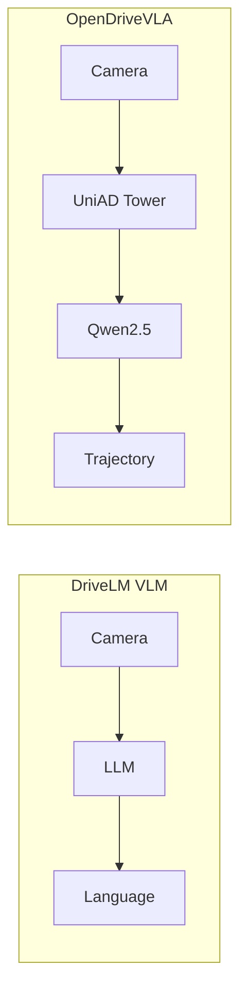
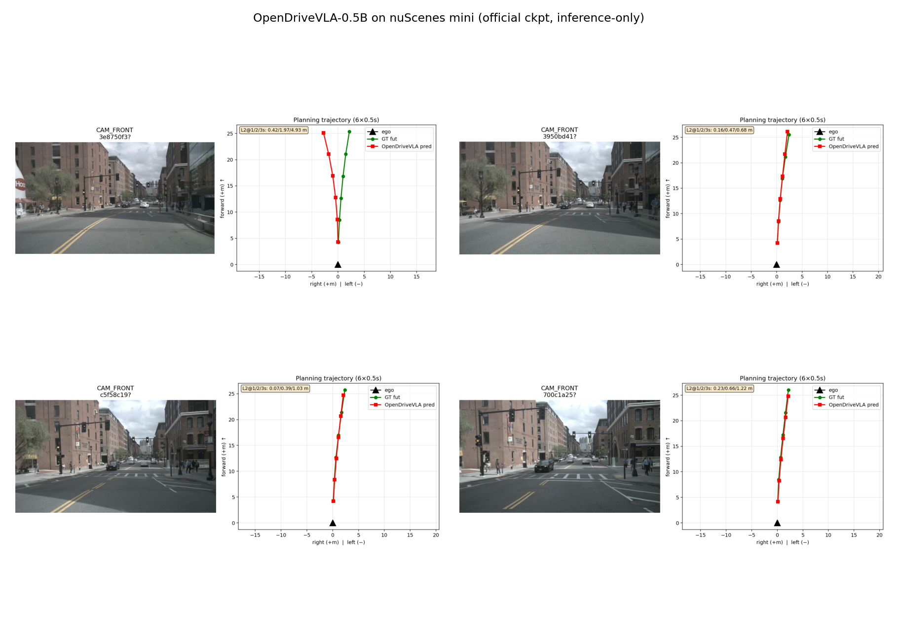

# 05b · VLA 与 OpenDriveVLA


## 差在哪一层

| | DriveLM | OpenDriveVLA |
|---|---|---|
| 输入 | 多相机 + 语言问题 | 多相机 + Ego / 历史 / Mission + Scene/Track/Map tokens |
| 中间 | Visual tokens → Adapter → LLaMA | UniAD track-map vision tower → Qwen2.5-0.5B |
| **输出** | **语言答案** | **Planning trajectory（6×0.5s 航点）** |
| Grounding | 场景理解 | 可执行动作（轨迹） |



## OpenDriveVLA 推理

- **模型**：官方 `OpenDriveVLA/OpenDriveVLA-0.5B`（HF gated，约 1.4GB safetensors）
- **数据**：nuScenes **mini** val（81 frames）；仅推理
- **环境**：torch 2.1.2+cu118 · mmcv 1.7.2 · mmdet3d 1.0.0rc6 · transformers 4.37.2

示例预测（样本 `3e8750f3…`，mission = turn right）：

```text
[(0.00,4.28),(-0.13,8.56),(-0.47,12.79),(-1.00,16.94),(-1.78,21.06),(-2.76,25.13)]
```

自建 mini cache 上粗开环 L2 @ 1/2/3s ≈ **0.42 / 1.97 / 4.93 m**（仅作可视化量级，非论文指标）。同 showcase 内另有 L2@3s ≈ 0.7–1.2 m 的较好样本，方差较大。



单帧卡片：`assets/opendrivevla/vla_*.png`

**读图说明**：自建 mini cache 时，历史轨迹（`his`）可能为空 / 近似零。主结论仍是：相机 + scene tokens → LLM → 未来轨迹。本仓库未做闭环评测。

## 认知主线

```text
Camera → UniAD vision tokens → LLM Reasoning → Trajectory / Action
```

DriveLM 停在「理解与解释」；OpenDriveVLA 跨到 **Action Grounding**。

## 实践关注点

Real-time · Hallucination · Long-tail · Closed-loop · Safety · Sim-to-Real

## 范围

- DriveLM = **VLM / 驾驶问答**（[card](../assets/drivelm/drivelm_qa_card.png)）
- OpenDriveVLA = **VLA / 轨迹规划**，官方预训练权重 + mini 推理可视化
- 不包装成量产 VLA 控车
