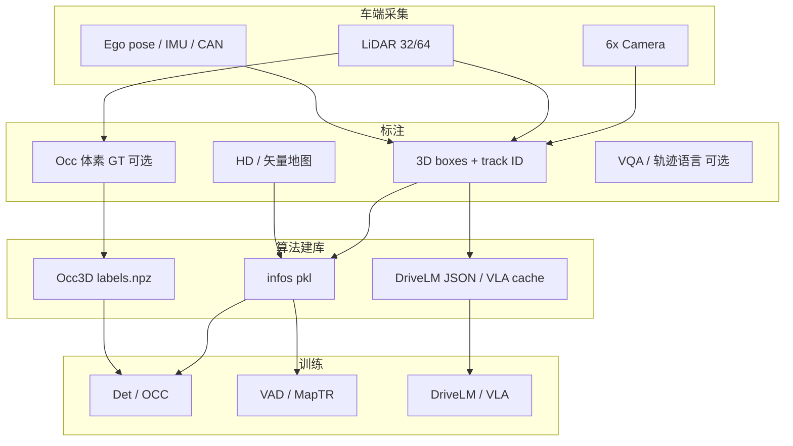

# 06 · 数据采集、数据集构建与训练

> 本文说明本仓库涉及各模型：**原始数据从哪来 → 训练用标注/infos 怎么建 → 典型训练怎么跑**。  
> 本仓库本身以 **官方预训练权重 + nuScenes mini 推理** 为主；完整训练需 **full trainval** 与多卡资源，命令以各上游 README 为准。

## 1. 总览：谁在采数据、谁在训模型


| 层级         | 谁做                             | 产出                                                    |
| ---------- | ------------------------------ | ----------------------------------------------------- |
| 车端采集       | nuScenes 等公开数据集的采集车队；量产车则为车企自采 | 多相机图、LiDAR 点云、IMU/位姿、CAN、地图                           |
| 人工 / 半自动标注 | 数据集方或车企标注体系                    | 3D 框、类别、track ID、地图元素、occupancy 等                     |
| 算法侧「建库」    | 各开源仓库的 `create_data*`          | `*_infos_*.pkl`、Occ3D `labels.npz`、VQA JSON、VLA cache |
| 训练         | 检测 / OCC / 规划 / VLM 各自 env     | `.pth` / HF 权重                                        |





**本仓库复现边界**：不重新采数据、不从头全量训练；用公开 nuScenes（mini）+ Occ3D mini + 官方 ckpt。

---


## 2. 公共底座：nuScenes 如何采集与组织


### 2.1 采集（数据集方完成）

nuScenes 采集车典型配置（公开文档量级）：


| 传感器             | 作用                                    |
| --------------- | ------------------------------------- |
| 6 路环视相机         | 多视角图像（`samples/` 关键帧 + `sweeps/` 中间帧） |
| 1 路旋转 LiDAR     | 点云；3D 框主要在此坐标系标注                      |
| IMU / GPS / 里程计 | 位姿链；支撑时序对齐与全局坐标                       |
| CAN bus（扩展包）    | 车速、转向等；MapTR / BEVFormer 等部分管线会用      |


城市道路场景按 **scene** 切段；每 scene 内按约 2 Hz 关键关键 **sample**（带完整标注），中间有更高频 **sweep**（常无完整 3D 框，供时序）。

### 2.2 官方发布目录

```text
nuscenes/
├── samples/          # keyframe 图像 / 点云
├── sweeps/           # 非 keyframe
├── maps/             # 栅格地图等
├── v1.0-trainval/    # 或 v1.0-mini / v1.0-test：元数据 JSON
└── can_bus/          # 可选扩展
```

关键元数据：`sample` / `sample_data` / `sample_annotation` / `ego_pose` / `calibrated_sensor` / `instance`（track）等。  
**算法训练几乎不直接扫 JSON**，而是先跑各仓库的 converter，落成 **infos pkl**。

### 2.3 训练集如何划分


| Split    | 规模（量级）                        | 用途                        |
| -------- | ----------------------------- | ------------------------- |
| train    | ~700 scene / ~28k keyframe    | 训练                        |
| val      | ~150 scene / ~6k keyframe     | 论文表、调参                    |
| test     | ~150 scene                    | 挑战赛提交（无公开 3D 框）           |
| **mini** | 10 scene / val 约 **81** frame | 本仓库演示；**不可**对标论文 full-val |


---


## 3. 各模型：数据需求 → 建库 → 训练

下列「建库命令」为上游惯用写法；路径、`--version` 以对应仓库当前 README 为准。

### 3.1 BEVFormer（Camera dense BEV 检测）


| 项           | 内容                                                                                                                          |
| ----------- | --------------------------------------------------------------------------------------------------------------------------- |
| **需要的原始数据** | nuScenes 六相机图 + 标定 + ego 位姿；3D 框 GT；建议 CAN bus                                                                              |
| **标注用法**    | sample 级 3D box（LiDAR 系）→ 投影/监督；时序 queue 用相邻帧图像                                                                             |
| **建库**      | `tools/create_data.py nuscenes ... --canbus ./data` → `nuscenes_infos_temporal_{train,val}.pkl`（相对 mmdet3d 默认 infos 多了时序字段） |
| **预训练**     | 常用 FCOS3D / nuImage 等相机检测权重初始化 backbone                                                                                     |
| **训练要点**    | 多卡 `dist_train.sh` + `bevformer_small/base` config；损失含分类 + 3D box（L1 / GIoU 等）；temporal self-attn + spatial cross-attn      |
| **本仓库**     | 用官方 **small** ckpt 在 mini 上 test；未做全量重训                                                                                     |


```bash
# 建库（示意，在 BEVFormer 仓库内）
python tools/create_data.py nuscenes \
  --root-path ./data/nuscenes --out-dir ./data/nuscenes \
  --extra-tag nuscenes --version v1.0 --canbus ./data

# 训练（示意）
./tools/dist_train.sh projects/configs/bevformer/bevformer_small.py 8
```

---


### 3.2 StreamPETR（Camera sparse query + 时序）


| 项           | 内容                                                                                                                     |
| ----------- | ---------------------------------------------------------------------------------------------------------------------- |
| **需要的原始数据** | 同 nuScenes 六相机 + 3D 框；强调 **时序** 与可选 **2D 辅助标注**                                                                        |
| **建库**      | `tools/create_data_nusc.py ... --extra-tag nuscenes2d` → `nuscenes2d_temporal_infos_{train,val}.pkl`（额外 2D / temporal） |
| **预训练**     | R50：ImageNet / NuImage；更强：V2-99 + FCOS3D / DD3D 等                                                                      |
| **训练要点**    | streaming / sliding-window；object query 跨帧传递；DET R 式 3D 匹配损失；可选 flash-attn                                             |
| **本仓库**     | 官方 R50 flash/seq ckpt → mini 检测 + **在线 MOT 相机支路**                                                                      |


```bash
python tools/create_data_nusc.py \
  --root-path ./data/nuscenes --out-dir ./data/nuscenes \
  --extra-tag nuscenes2d --version v1.0
```

---


### 3.3 CenterPoint（LiDAR 检测）


| 项           | 内容                                                                                |
| ----------- | --------------------------------------------------------------------------------- |
| **需要的原始数据** | LiDAR 点云（keyframe；部分实现用多 sweep 累积）+ 3D 框                                          |
| **建库**      | 在 BEVFusion / mmdet3d 管线中生成 nuScenes lidar infos（或复用官方转换）；体素化在 dataloader 内完成     |
| **训练要点**    | Voxel / Pillar 编码 → 2D BEV backbone → center heatmap + 尺寸/朝向/速度回归；常用 CBGS 类采样缓解长尾 |
| **本仓库**     | BEVFusion 仓库 **lidar-only** 官方 ckpt；MOT 的 **birth / 主更新** 来源                      |


量产侧：点云需时间同步、运动补偿（deskew）、外参标定；开源复现默认信任 nuScenes 已处理好的位姿。

---


### 3.4 BEVFusion（Camera + LiDAR 检测融合）


| 项           | 内容                                                                                           |
| ----------- | -------------------------------------------------------------------------------------------- |
| **需要的原始数据** | 同时要相机与 LiDAR，且 **时间/外参对齐**                                                                   |
| **建库**      | 按 [BEVFusion](https://github.com/mit-han-lab/bevfusion) 准备 nuScenes；生成融合训练所需 infos / 元数据     |
| **训练要点**    | 相机分支（LSS 等）与 LiDAR 分支分别提特征，在 BEV 上 **conv fuser**；注意 config 里 `add_depth_features` 与 ckpt 一致 |
| **本仓库**     | 官方 fusion ckpt 推理对比；**跟踪主路径不用 BEVFusion**（融合放在 DualTracker 异步更新）                             |


---


### 3.5 FB-OCC（Camera Occupancy）


| 项                        | 内容                                                                                                                             |
| ------------------------ | ------------------------------------------------------------------------------------------------------------------------------ |
| **图像**                   | nuScenes 六相机（与检测相同采集）                                                                                                          |
| **Occupancy GT 从哪来**     | **不是**人工逐体素涂色。Occ3D 等用 **LiDAR 累积 + 可见性/语义投影** 自动生成稠密体素标签（`semantics` / `mask_camera` / `mask_lidar`）                          |
| **建库**                   | ① nuScenes infos（FB-BEV：`create_data_bevdet.py` 等）② 下载或生成 Occ3D `gts/<scene>/<token>/labels.npz` 并链到 config 的 `occupancy_path` |
| **体素约定（Occ3D-nuScenes）** | 范围约 [-40,40]\times[-40,40]\times[-1,5.4] m，分辨率 **0.4 m**，网格约 **200×200×16**，类定义对齐 lidarseg + free                              |
| **训练要点**                 | 官方 R50：`fbocc-r50-cbgs_depth_16f_...`；深度/语义联合预训练常见；损失为体素语义 CE / lovasz 等；评测用 **mask_camera** 下 mIoU                            |
| **本仓库**                  | 官方 R50 ckpt + Occ3D **mini** → mIoU **31.12**（full-val 官方约 **39.1**）                                                           |


```text
occ3d/gts/
└── scene-xxxx/
    └── <sample_token>/
        └── labels.npz   # semantics, mask_camera, ...
```

---


### 3.6 MapTR（在线矢量地图）


| 项           | 内容                                                                                                |
| ----------- | ------------------------------------------------------------------------------------------------- |
| **需要的原始数据** | 环视图像 + nuScenes **地图层** + 位姿；CAN bus 建议具备                                                         |
| **GT 怎么来**  | 从 nuScenes map API 按自车周围范围裁剪 **车道线 / 路沿 / 人行道** 等折线，再采样为固定点数的 polyline                            |
| **建库**      | `tools/create_data.py ... --canbus` → `nuscenes_infos_temporal_{train,val}.pkl`；评测另有 map ann json |
| **训练要点**    | 感知 Transformer 直接回归矢量；Hungarian 匹配 + 点集 / 方向损失；Chamfer / mAP 类指标                                  |
| **本仓库**     | 官方 tiny ckpt → mini Chamfer mAP **0.713**                                                         |


---


### 3.7 VAD（感知 + 规划端到端）


| 项           | 内容                                                                          |
| ----------- | --------------------------------------------------------------------------- |
| **需要的原始数据** | 相机时序 + 3D 框 + **矢量地图** + **自车未来轨迹**（由 nuScenes 位姿链导出）                       |
| **建库**      | VAD 定制 `vad_nuscenes_infos_temporal_{train,val}.pkl`（含 ego 历史/未来轨迹、map 元素等） |
| **训练要点**    | 常分 stage（先感知相关、再规划）；损失含检测 / map / 轨迹 L2 与碰撞约束等；**开环**计划指标 ≠ 闭环接管            |
| **本仓库**     | 官方 tiny ckpt → plan L2 等开环数                                                 |


---


### 3.8 DriveLM（VLM / Graph VQA）


| 项           | 内容                                                              |
| ----------- | --------------------------------------------------------------- |
| **需要的原始数据** | nuScenes 图像 + DriveLM 发布的 **场景图 / QA** 标注（感知、预测、规划相关问题）         |
| **建库**      | 上游 `extract` → `convert2llama`：把图与问答转成 LLaMA-Adapter 训练/推理 JSON |
| **训练要点**    | 冻结或低频更新 LLaMA；训 adapter / bias；需要 **LLaMA-1** 权重（与 Llama-2 不混用） |
| **本仓库**     | 官方 **BIAS-7B** + 自备 LLaMA-1 → `demo.py` Graph VQA               |


---


### 3.9 OpenDriveVLA（VLA 轨迹）


| 项           | 内容                                                          |
| ----------- | ----------------------------------------------------------- |
| **需要的原始数据** | 图像 / 感知 token 化输入 + 轨迹监督（官方 pipeline 定义）                    |
| **建库**      | 按官方构建 scene / track / map 等 **cache**；mini 上历史轨迹 `his` 可能为空 |
| **训练要点**    | 视觉–语言–动作联合；本仓库用 HF **OpenDriveVLA-0.5B** 做轨迹推理展示，不覆盖全量训程    |


---


### 3.10 在线 3D MOT（本仓库脚本）


| 项              | 内容                                                                                   |
| -------------- | ------------------------------------------------------------------------------------ |
| **「训练数据」**     | **无端到端学习训练集**。检测来自 CenterPoint / StreamPETR；关联为 KF + 门控最近邻                           |
| **若要数据驱动 MOT** | 需 nuScenes Tracking 的 track ID 序列，训 TrackFormer / 学习关联等（超出本仓库范围）                     |
| **本仓库**        | `online_lidar_mot.py` / `online_dual_mot.py`（结果回放）与 `online_e2e_dual_mot.py`（同进程真推理） |


---


## 4. 量产视角：和公开集差在哪


| 公开 nuScenes / Occ3D | 量产                              |
| ------------------- | ------------------------------- |
| 固定传感器套件与标定文件        | 多车型标定产线、外参在线估计                  |
| 人工精标 3D 框 + 自动 Occ  | 自动标注为主，人工抽检；Occ 多用自车 LiDAR/多帧融合 |
| 固定 train/val scene  | 连续流入、域偏移（天气/城市/车型）              |
| 开环 mAP / mIoU / L2  | 加上延迟预算、误检安全代价、闭环里程              |


采集原则相同：**多传感器时间同步 → 标定 → 位姿 → 标注规范 → 版本化数据集**；算法侧再建各自 infos。

---


## 5. 训练落地检查清单（通用）

1. **先定 split**：full trainval 才能对标论文；mini 只适合打通与演示。
2. **按仓库独立 conda**，勿混 mmcv / mmdet3d。
3. **跑通官方** `create_data`*，确认 pkl 帧数与 token 和 `v1.0-*` 一致。
4. OCC 确认 `labels.npz` 与 `occupancy_path`、`mask_camera` 评测开关。
5. 预训练权重与 config（输入尺寸、depth 特征、类数）严格对齐。
6. 多卡 `dist_train`；单卡仅适合 debug / tiny。
7. 验证：官方 eval 脚本出 mAP/NDS/mIoU；再谈可视化。

---


## 6. 和本仓库其它文档的关系


| 文档                                                                                  | 关系                        |
| ----------------------------------------------------------------------------------- | ------------------------- |
| [SETUP.md](../SETUP.md)                                                             | 下载、目录、env、ckpt 放置         |
| [REPRO.md](../REPRO.md)                                                             | **推理**命令（本仓库主路径）          |
| [01](01-bev-3d-detection.md) · [03](03-occupancy.md) · [04](04-e2e-map-tracking.md) | 算法在做什么、指标与图               |
| 本文                                                                                  | **数据从哪来、怎么建成训练格式、训练怎么组织** |


**一句话**：传感器与 3D/地图标注来自 nuScenes（及 Occ3D 自动体素）；各模型用自己的 converter 建成 infos；训练是在对应 config 上做监督（或 VLM adapter）。本仓库跳过全量训练，直接用官方 ckpt 在 mini 上证明链路与观感。