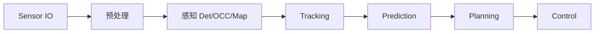
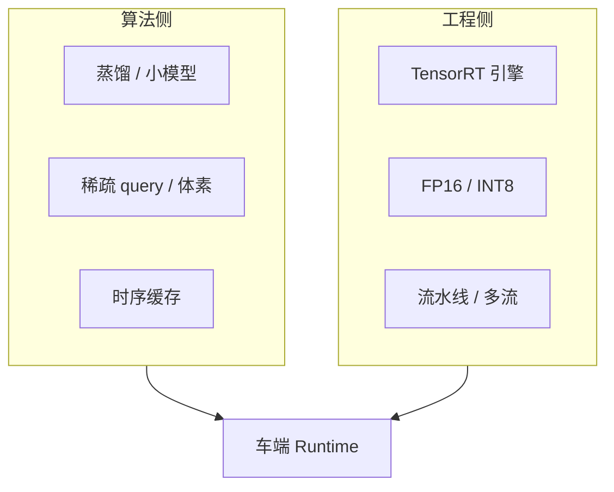
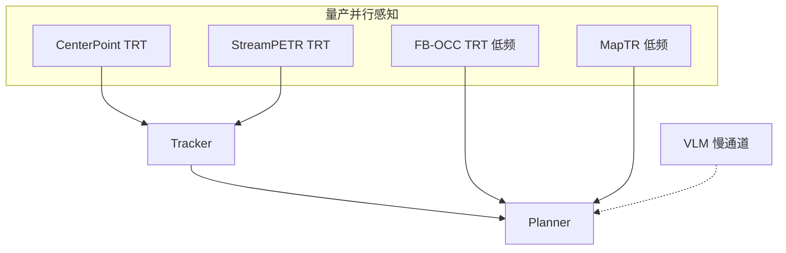

# 07 · 量产部署加速：瓶颈与方案

> 开源 PyTorch 权重能跑通 ≠ 能量产。车规感知通常要在 **Orin / Thor / 域控 SoC** 上满足固定 **延迟预算**（常见关键路径 ≤50–100 ms 量级，视车型与功能等级而定）。  
> 本文按本仓库涉及模型，写清：**要加速什么 → 为什么慢 → 常用方案 → 与本仓库实测的关系**。

## 1. 先定预算，再谈加速

| 原则 | 说明 |
|---|---|
| **按域拆预算** | 相机感知、LiDAR 感知、融合、跟踪、规划各自有 ms 上限，超时则降级而非整体卡死 |
| **端到端墙钟** | 只报单模块 FLOPs 不够；要含解码、NMS、CPU↔GPU、多传感器同步 |
| **精度–延迟 Pareto** | INT8 / 蒸馏 / 降分辨率都会掉点；用 val 集 + 安全场景回归 |
| **本仓库数字** | RTX 4090 + PyTorch，**参考不是车规**；10 scenes / 402 帧 E2E live MOT 合计约 **911 ms（~1.1 FPS）** |

本仓库同进程真推理分段（mini 全部 10 scenes / 402 帧，见 [`latency_summary_long_all.json`](../assets/tracking/latency_summary_long_all.json)）：

| 段 | mean | 部署含义 |
|---|---:|---|
| CenterPoint | ~209 ms | LiDAR 头在桌面 PyTorch 已偏慢，车端必须 TRT/稀疏 |
| StreamPETR | ~626 ms | **主瓶颈**（六相机 + Transformer） |
| DualTracker | ~7 ms | 关联本身便宜；瓶颈在检测 |
| **合计** | **~911 ms** | 远高于量产关键路径预算 |

---

## 2. 通用加速工具箱

| 手段 | 做什么 | 适用 |
|---|---|---|
| **TensorRT / ONNX-TRT** | 算子融合、引擎缓存、FP16/INT8 | CNN / 多数 Transformer 子图 |
| **FP16 / BF16** | 减带宽与算力 | 几乎所有 GPU 推理 |
| **INT8 PTQ / QAT** | 进一步压延迟与功耗 | backbone、Neck；Head 常保留 FP16 |
| **输入降分辨率 / 裁剪 FOV** | 直接砍算力 | 相机头；远距掉点要评估 |
| **时序复用** | 非关键帧少算 / 用缓存 query、BEV | StreamPETR、BEVFormer、OCC |
| **稀疏化** | 少 query、少体素、少 sweep | PETR 系、CenterPoint、OCC |
| **蒸馏 / 小骨干** | R50←R101/V2-99；tiny←base | 全系 |
| **异步流水** | 感知与规划并行；相机与 LiDAR 分核 | 多 SoC / 多流 |
| **算子替换** | DeformAttn、FlashAttn、自定义 Plugin | BEVFormer / StreamPETR / MapTR |
| **后处理下沉** | NMS、解码在 GPU 或专用核 | Det / Map |

---

## 3. 分模型：要加速的内容与方案

### 3.1 CenterPoint（LiDAR 检测）

| 要加速的内容 | 原因 |
|---|---|
| Voxelization / Pillar 编码 | CPU 或散乱写 GPU 易成瓶颈 |
| 3D/2D backbone + neck | 大 BEV 特征图吃带宽 |
| Center head + NMS | 类别多、框多时后处理涨 |

**方案**

1. TRT：backbone+neck+head 整图；voxelization 用 CUDA 自定义或库（如 SpConv / 厂商插件）。  
2. 降 voxel 分辨率或探测范围（如远距稀疏）。  
3. 少 sweep 累积、运动补偿与推理流水重叠。  
4. INT8：backbone 优先；heatmap 头谨慎。  
5. 量产常与相机异步：LiDAR 10–20 Hz 独立流，跟踪器时间对齐。

**相对本仓库**：~220 ms @4090 PyTorch → 车端目标通常压到 **十余 ms 量级**（视范围与分辨率）。

---

### 3.2 StreamPETR（相机 3D，本仓库 E2E 主瓶颈）

| 要加速的内容 | 原因 |
|---|---|
| 六路 backbone（R50/V2-99） | 多图并行仍占大头 |
| Transformer / 时序 query | Attention 与跨帧状态 |
| 高输入分辨率（如 704） | 与精度强相关 |
| 后处理与多帧缓存拷贝 | 工程开销 |

**方案**

1. **Flash-Attention / 融合 Attention Plugin**（训练侧已可选；部署要 TRT 支持或自研）。  
2. TRT FP16：图像骨干 + PETR 头；固定 max query 数。  
3. 降分辨率 / 少相机（如高速只前视+前角）做模式切换。  
4. **流式时序**：复用历史 query，避免每帧冷启动全量算。  
5. 蒸馏到更小 backbone；或关键目标子集（车/人）与全类模型分级。  
6. 与 LiDAR 检测 **勿串行死等**：本仓库 E2E 演示是串行 CP→SP；量产应 **并行推理 + 跟踪融合**。

**相对本仓库**：~634 ms 单帧串行 → 并行化后墙钟≈`max(CP, SP)`，再加 TRT 才接近预算。

---

### 3.3 BEVFormer（Dense BEV Query）

| 要加速的内容 | 原因 |
|---|---|
| Temporal Self-Attn + Spatial Cross-Attn | Deformable Attention 部署不友好 |
| 稠密 BEV grid | 显存与算力随 H×W 涨 |
| 多帧 queue | 时序越深越慢 |

**方案**

1. 官方/社区 **TensorRT / 部署分支**；DeformAttn 写成 TRT Plugin。  
2. 减 BEV 分辨率、减 encoder layer、减 queue_length。  
3. FP16 + INT8 PTQ；tiny/small 骨干。  
4. 用稀疏 query 系（PETR/StreamPETR）替换部分场景以换延迟。

---

### 3.4 BEVFusion（Cam+LiDAR 融合检测）

| 要加速的内容 | 原因 |
|---|---|
| 双分支同时跑 | 延迟≈两路之和或受慢者限制 |
| View transform（LSS） | 深度分布 lift/splat 重 |
| Fuser + 大 BEV | 带宽密集 |

**方案**

1. 两路 **并行** 在不同加速核/流；融合仅等对齐时刻。  
2. TRT 分拆 Cam / Lidar / Fuse 三个 engine，便于单独升级。  
3. 相机支路降分辨率；LiDAR 支路减范围。  
4. 量产也可「检测不融合、跟踪融合」（本仓库 DualTracker 路线），把融合从重网络挪到轻量关联。

---

### 3.5 FB-OCC（Occupancy）

| 要加速的内容 | 原因 |
|---|---|
| 多相机 backbone + view transform | 与 BEV 检测类似 |
| 3D 体素头（200×200×16 量级） | 输出体量大，写回与后处理贵 |
| 时序 16f 等配置 | 多帧更准也更慢 |

**方案**

1. **NVlabs FB-BEV 明确有 TensorRT / DRIVE 部署路径** —— OCC 优先走官方 TRT 流程。  
2. 降体素分辨率或只出 **occupied / 可行驶** 粗语义供规划，细语义低频跑。  
3. 近距稠密、远距稀疏的 **多分辨率 Occ**。  
4. FP16/INT8；短时序或单帧模式做降级。  
5. 后处理：不要每帧全量拷到 CPU 做可视化式 collapse；规划直接吃 GPU buffer。

---

### 3.6 MapTR（矢量地图）

| 要加速的内容 | 原因 |
|---|---|
| Backbone + BEV/PV Transformer | 与相机感知同构 |
| `geometric_kernel_attn` 等自定义算子 | 需编译 / Plugin |
| 多折线解码 | 后处理相对轻 |

**方案**

1. TRT + 固定 polyline query 数。  
2. 地图更新 **低于感知频率**（如 2–5 Hz），中间帧用里程计推。  
3. 小骨干 tiny；ROI 只建自车前方走廊。

---

### 3.7 VAD（端到端规划）

| 要加速的内容 | 原因 |
|---|---|
| 感知–地图–规划共享大 Transformer | 单次前向重 |
| 多任务头 | 输出多、难裁剪 |

**方案**

1. tiny 配置 + TRT；规划头可与感知 **同频或半频**。  
2. 开环 L2 达标 ≠ 可部署：需加 **超时降级到规则/备份规划器**。  
3. 蒸馏：大 VAD 教师 → 车端学生。  
4. 与模块化栈对比时，量产常保留「可切换」：E2E 主路径 + 经典备份。

---

### 3.8 DriveLM / OpenDriveVLA（VLM / VLA）

| 要加速的内容 | 原因 |
|---|---|
| LLM / Transformer 解码 | 自回归或大上下文延迟高 |
| 多图视觉编码 | 与感知抢算力 |
| 7B 级权重 | 显存与带宽 |

**方案**

1. **不要进 10 Hz 控制闭环**。放在事件触发 / 低速 / 问答 / 决策辅助（1 Hz 或更低）。  
2. 小模型（0.5B–2B）、量化（INT4/INT8）、投机解码、KV cache。  
3. 视觉 token 重用感知骨干特征，避免再跑一套大 ViT。  
4. 车端用专用 LLM 加速库（TensorRT-LLM / 厂商 runtime）。

---

### 3.9 在线 3D MOT（本仓库 DualTracker）

| 要加速的内容 | 原因 |
|---|---|
| 检测输入延迟 | Track 本身约 **9 ms**，不是主因 |
| 关联复杂度 | 目标数×门控，通常仍远小于检测 |

**方案**

1. 优先加速 **上游 Det**；Track 保持 KF+门控 NN 或轻量学习关联。  
2. 相机与 LiDAR 检测 **异步到达**，跟踪器按时间戳更新（本仓库已是异步融合思路）。  
3. 限制最大 track 数、远距降采样关联。  
4. 整段 MOT 可放 CPU；省 GPU 给检测。

---

## 4. 推荐的量产部署形态（对照本仓库演示）

| 本仓库演示 | 量产更合理 |
|---|---|
| CP → SP **串行** 同进程 | CP ∥ SP **并行**，Tracker 融合 |
| PyTorch FP32/FP16 Eager | TRT engine + 固定 shape |
| 每帧全量六相机高分辨率 | 场景模式：高速裁剪 / 泊车全周 |
| OCC 与 Det 同等可视化频率 | Occ 降频或粗粒度供规划 |
| VLM 与感知同机随意跑 | VLM 独立慢通道 |
| 4090 桌面延迟当宣传 | SoC 实测 + 最坏情况延迟 |

---

## 5. 落地顺序（工程）

1. **量墙钟**：单模块 + 端到端 p50/p95/p99（含预处理）。  
2. **ONNX 导出** → 算子覆盖率报告 → 补 Plugin。  
3. **FP16 TRT** 对齐精度（允许小幅掉点）。  
4. **INT8** 校准集（含夜间/雨雾）。  
5. **并行与降频策略** 写入调度器。  
6. **失效降级**：超时、checksum、输入异常 → 备份栈。  
7. 车规：温度、功耗、长期运行显存泄漏、OTA 引擎版本绑定。

---

## 6. 口述要点（面试 / 评审）

1. 加速对象首先是 **相机 Transformer 检测与 OCC**，不是 KF 跟踪。  
2. 本仓库约 911 ms 说明「能跑」；量产要用 **TRT + 并行 + 降频**。
3. 融合可放在网络（BEVFusion）或跟踪层（本仓库）；后者更易分模块加速与降级。  
4. VLM/VLA 加速有意义，但 **频率定位** 比再抠 5 ms 更重要。  
5. 任何量化/蒸馏必须带 **安全相关场景回归**，不能只看均值 mAP。

---

## 7. 相关文档

| 文档 | 关系 |
|---|---|
| [04 · 端到端与跟踪](04-e2e-map-tracking.md) | E2E live 延迟表 |
| [06 · 数据与训练](06-data-and-training.md) | 训练侧如何得到可部署权重 |
| [05 · 技术栈总览](05-stack-overview.md) | 全链路 |
| [REPRO.md](../REPRO.md) | 桌面复现命令（非车端） |
